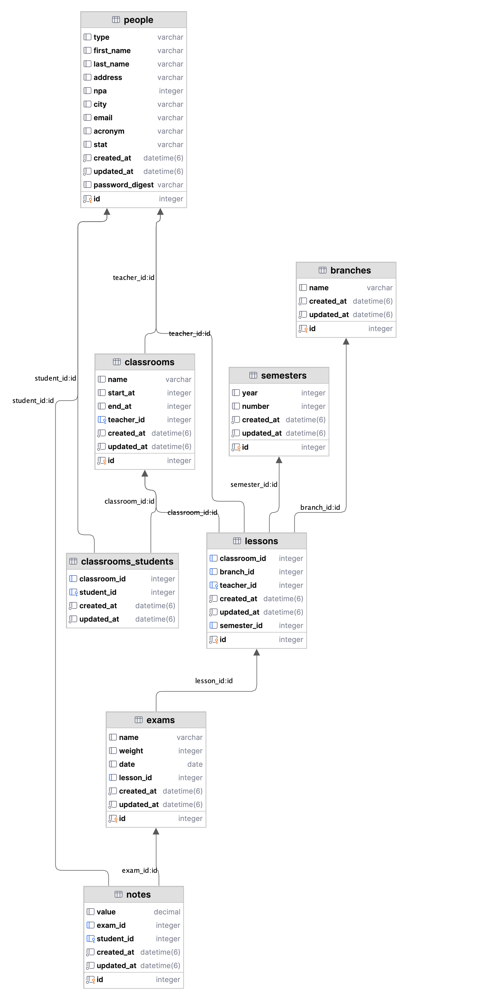

# Gesteleves documentation
## Introduction
Gestélèves est un projet développé pour faciliter la gestion des élèves, enseignants et du personnel administratif au sein d'établissements éducatifs. Ce document fournit un aperçu des dépendances utilisées, des fonctionnalités clés telles que l'authentification et la gestion des droits, ainsi qu'une webographie pour des références supplémentaires.
## Dépendences
Le projet Gesteleves utilise les gems Ruby suivantes pour ses différentes fonctionnalités :

- **bcrypt**: Utilisée pour sécuriser l'authentification des utilisateurs en hachant les mots de passe.
- **cancancan**: Permet une gestion fine des droits d'accès en fonction des rôles des utilisateurs.
- **bootstrap**: Intègre un framework CSS pour le design et la mise en page responsive du projet.
- **sqlite3**: Employée comme système de gestion de base de données pour le stockage des informations relatives aux utilisateurs, cours, notes, etc.

## Authentification
L'authentification est un processus crucial permettant de sécuriser l'accès aux différentes parties de l'application. Gestélèves utilise bcrypt pour garantir que les informations de connexion des utilisateurs sont sécurisées. Chaque utilisateur doit s'identifier pour accéder aux fonctionnalités qui lui sont autorisées en fonction de son rôle.

## Gestion des droits
La gestion des droits dans Gestélèves est assurée par la gem **cancancan**, permettant de définir facilement qui peut faire quoi au sein de l'application. Les droits sont spécifiés dans le modèle **`ability.rb`** comme suit :
```ruby
class Ability
  include CanCan::Ability

  def initialize(person)
    person ||= Person.new  # Assume une personne non connectée par défaut
    case person.type
    when 'Dean'
      can :manage, [Classroom, Person, Semester, Note, Exam, Lesson, Branch]
    when 'Teacher'
      can :read, Lesson, teacher_id: person.id
      can :manage, Exam, lesson: { teacher_id: person.id }
      can :manage, Note, exam: { lesson: { teacher_id: person.id } }
    when 'Student'
      can :read, Student, id: person.id
    end
  end
end

```
## Rôles et Permissions
- **Dean**: Accès complet pour gérer toutes les ressources.
- **Teacher**: Peut lire les leçons qui lui sont assignées, ajouter des notes aux étudiants dans ses cours.
- **Student**: Peut uniquement consulter son bulletin de notes.

## Base de donnée


### Tables
#### `people`
- **STI** : Implémente l'Héritage de Table Unique pour stocker différents types d'utilisateurs dans une seule table. Les types possibles sont `Dean`, `Student` et `Teacher`.
- **Attributs communs** : Comprend des attributs communs tels que `first_name`, `last_name`, `address`, etc.
- **Sécurité des mots de passe** : Utilise `password_digest` pour le hachage sécurisé des mots de passe avec `bcrypt`.

#### `classrooms`
- Représente les salles de classe.
- `start_at` et `end_at` définit la durée pendant laquelle la classe sera "active".
- La clé étrangère `teacher_id` associe une salle de classe à un enseignant.

#### `classrooms_students`
- Table de jonction pour une relation plusieurs-à-plusieurs entre `students` et `classrooms`.
- Permet d'associer plusieurs élèves à plusieurs salles de classe.

#### `branches`
- Représente les différentes matières pouvant être enseignées.
#### `semesters`
- Stocke des informations liées aux différents semestres
- `year` Année du semestre
- `number` Numéro du semester (1 ou 2)
#### `lessons`
- Représente les cours enseignés.
- Liée aux `classrooms`, `branches`, `teachers` et `semesters`.

#### `exams`
- Gère les examens liés à un cours.

#### `notes`
- Enregistre les notes des élèves pour les examens.
- `value` est utilisé pour la note réelle, lié à la fois aux `exams` et aux `students`.

### Considérations Normatives

Le schéma peut ne pas adhérer strictement à toutes les formes normales de conception de base de données. Cela est souvent intentionnel au sein des applications Rails pour équilibrer les besoins de performance ou pour simplifier le développement.

### Conventions de Rails

Le schéma suit les conventions de Rails, y compris :
- `id` comme clé primaire auto-incrémentée.
- Nomination des clés étrangères avec `_id`.
- Noms de table au pluriel et noms de modèles au singulier.
- Horodatage `created_at` et `updated_at` pour la tenue automatique des enregistrements de créations et de modifications.

Le respect de ces conventions permet à Rails de fournir une multitude de fonctionnalités automatiques, comme les associations entre modèles et la gestion simplifiée des migrations de base de données.
## Webographie
[Documentation ruby on rails](https://guides.rubyonrails.org/)
[Gem cancancan](https://github.com/CanCanCommunity/cancancan)
[Gem bcrypt](https://rubygems.org/gems/bcrypt/versions/3.1.12?locale=fr)
[Bootstrap](https://getbootstrap.com/)
[Gem bootstrap](https://github.com/twbs/bootstrap-rubygem)


